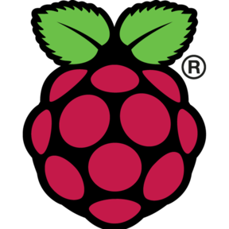

## 💻 Skills

  <h2> General info:</h2>

  -  Currently working in a <a href="https://github.com/AlexandreWN/ProjetoCampinas_Curitiba">project</a> for my company
  -    Software development trainee at Bosch 
  -    20 years old
  -    I'm a Computer Engineering student
  -    How to reach me: nicholasstelmach@icloud.com

## 💬 Languages

  
  
  
  
  
  
  
  

## ♨ Databases

  
  
  

## 🛠 Dev Tools

    
    
    
  
  
  
  
  

## 💡 Maker stuffs

  
    

### This readme.md was heavily based on my friend [dalisone](https://github.com/dalisone)
